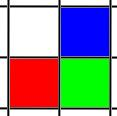

# On The Way Home

## Problem

You are at the top left corner of a grid and your home is at the bottom right corner. In how many unique ways can you reach home?

### Constraints

Only two movements are available (to go from one point of the grid to another):

- `down`
- `right`

### Input

- `R`: number of rows of the grid
- `C`: number of columns of the grid

### Output

- `n`: number of unique ways you can reach home

## Definitions

- `row` and `column`: a natural number
- `Position(r, c)`: a place in the grid identified by its row `r` and column `c`
- `Terrain(R, C)`: a matrix of R*C Positions, with `R` rows and `C` columns
- `Adjacent Positions`: two positions `P1(r1,c1)`, `P2(r2,c2`) are adjacent if and only if `(r1==r2 and |c1-c2|=1) or (c1==c2 and |r1-r2|=1)`
- `Path`: a tuple of positions such that consecutive positions are adjacent
- `NP(p)`: the number of unique paths from the origin position `P(0,0))` to a destination position `p`

## Solution

In the figure above, suppose one knows the number of the unique ways to reach both the positions red and blue. Being that the case, then we can compute the number of the unique ways to reach the position green as the sum of the number of the red and the blue.

That is because:

- at the position red, one can reach the position green by going right
- at the position blue, one can reach the position green by going down

and all of those paths are different.

In a more mathematical way: `NP(p(r,c)) = NP(p(r-1,c)) + NP(p(r,c-1))`

### Boundary Conditions

There is only one unique path to reach any position at the first row or at the first column:

- `NP(p(0,c)) = 1, forall c`
- `NP(p(r,0)) = 1, forall r`
