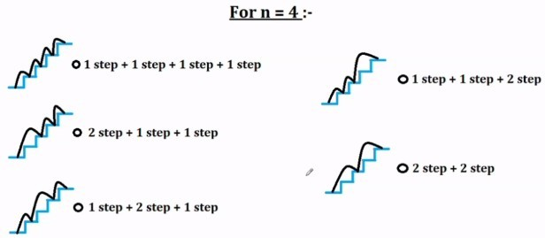

# Stairway to Heaven

## Problem

You want to reach the heaven, which is at the top of a staircase.

The staircase has `n` steps. At each step, you can climb either one step or two steps further.

In how many ways can you reach heaven?



## Solution - Recursion

Let `W` be the function which associates a number of steps with the number of **W**ays you can reach heaven.

```pseudocode
W(n) = W(n - 1) + W(n - 2)
W(0) = 1 /* if you are already there, then there is one way, stay where you are */
W(1) = 1
W(2) = 2
```

Such solution allows memoization.

## Solution - Sum

```pseudocode
let limit = quotient(n, 2)
W(n) = sum
    from i = 0
    to i = limit
    of
        (n-i)! / ( i! * (n - 2*i)! )
```

That is not particularly obvious, but if you spend some time analysing how one constructs all possibilities and if you apply a bit of combinatorial analysis, you get there...

## Solution - Fibonacci

Notice that the solution to this problem is a Fibonacci number.
